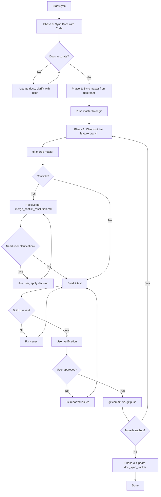

# XConnect Fork Sync - Complete Procedure

## Overview

This document defines the **complete workflow** for syncing the XConnect fork with upstream RustDesk.

```
┌─────────────────────────────────────────────────────────────────────┐
│                    FORK SYNC WORKFLOW                                │
├─────────────────────────────────────────────────────────────────────┤
│  Phase 0: DOCS SYNC      → Sync docs with current code state        │
│  Phase 1: MASTER SYNC    → Sync master from upstream                │
│  Phase 2: BRANCH SYNC    → Merge master into feature branches       │
│  Phase 3: POST-SYNC      → Update doc_sync_tracker.md               │
└─────────────────────────────────────────────────────────────────────┘
```

> [!IMPORTANT]
> **DOCS FIRST.** Always sync documentation with current code state BEFORE syncing with upstream.
> This ensures docs accurately reflect what custom code exists, making conflict resolution clearer.

---

## Phase 0: Documentation Sync (BEFORE Code Sync)

### Purpose
Ensure all documentation reflects the **current state of code** in each branch before syncing with upstream. This helps LLMs understand what custom code to preserve during merge conflicts.

### 0.1 Review Recent Commits

```bash
# For each feature branch, check commits since last doc sync
git checkout windows_android_build
git log --oneline -20  # Review recent changes

git checkout linux_build
git log --oneline -20
```

### 0.2 Identify Documentation Gaps

For each branch:
- [ ] Check if new files were added (should be in features.md)
- [ ] Check if files were deleted (remove from features.md)
- [ ] Check if custom patterns changed (update llm_sync_guide.md)
- [ ] Check if new constants were added (update llm_sync_guide.md)

### 0.3 Clarify Confusing Changes (If Needed)

If commits are unclear:
1. **Ask user** about the intent of the change
2. Document the purpose in appropriate .md file
3. Add `// XCONNECT:` comments to code if helpful

### 0.4 Update Documentation

Update these files as needed:
- `windows_android_build_features.md` - File list for client branch
- `linux_build_features.md` - File list for projector branch
- `llm_sync_guide.md` - Custom patterns, constants, critical code
- `xconnect_rename_tracker.md` - Any new rename patterns

### 0.5 Verify Doc Accuracy

```bash
# Check that documented files still exist
for file in $(cat windows_android_build_features.md | grep -E "^\s*-\s*\`" | sed 's/.*`\([^`]*\)`.*/\1/'); do
  [ -f "$file" ] || echo "MISSING: $file"
done
```

**Checkpoint:** Get user confirmation before proceeding to Phase 1.

---

## Phase 1: Master Sync (From Upstream)

### 1.1 Fetch and Merge Upstream

```bash
# Ensure we have upstream remote
git remote add upstream https://github.com/rustdesk/rustdesk.git 2>/dev/null || true

# Fetch latest
git fetch upstream

# Checkout and update master
git checkout master
git merge upstream/master

# Update submodules
git submodule update --init --recursive
```

### 1.2 Push Updated Master

```bash
git push origin master
```

> [!WARNING]
> Submodule update will reset config.rs changes. These will be re-applied during branch sync.

---

## Phase 2: Branch Sync (ONE BRANCH AT A TIME)

### Branches to Sync (In Order)
1. `windows_android_build` (Android/Windows client)
2. `linux_build` (Linux projector)

> [!IMPORTANT]
> **Complete ALL steps for one branch before starting the next.**

---

### Step 2.1: Start Merge

```bash
git checkout <branch_name>
git merge master
```

Git will list conflicting files.

---

### Step 2.2: Resolve Conflicts

For each conflict file, follow [merge_conflict_resolution.md](./merge_conflict_resolution.md):

| Conflict Type | Resolution |
|---------------|------------|
| Generated (`Cargo.lock`) | Accept upstream, regenerate |
| Branding (specs, package names) | Keep ours |
| 100% Custom files | Keep ours entirely |
| Feature + Upstream | Merge carefully, preserve custom code |

**If conflict is unclear:**
1. Show both versions to user
2. Ask for clarification on what to keep
3. Apply user's decision
4. Document the decision for future syncs

---

### Step 2.2a: Apply Post-Merge Fixes (CRITICAL)

> [!IMPORTANT]
> After resolving conflicts, apply ALL post-merge fixes from [post_merge_fixes.md](./post_merge_fixes.md).

**Quick checklist:**
- [ ] Update `libs/hbb_common` submodule to master's expected commit
- [ ] Apply XConnect branding to `libs/hbb_common/src/config.rs`
- [ ] For `linux_build`: Add `x_connect_device_name` field and make `load()/store()` public
- [ ] Verify `libs/portable/Cargo.toml` has `windows` crate dependency
- [ ] Verify `libs/portable/src/bin_reader.rs` uses `"xconnect"` identifier
- [ ] Restore `Cargo.lock` from master if needed

---

### Step 2.3: LLM Verification

```bash
# Build tests
cargo build --release
cd flutter && flutter pub get
flutter build android  # or linux/windows as appropriate

# Branding check
grep -rn "rustdesk" --include="*.dart" --include="*.rs" --include="*.kt" \
  | grep -v "github.com/rustdesk" | grep -v ".git" | grep -v "Cargo.lock"
```

Report any build errors or unexpected "rustdesk" references.

---

### Step 2.4: User Verification (REQUIRED)

**Notify user and ask them to verify:**
- [ ] App launches successfully
- [ ] Core features work (discovery, connection modes)
- [ ] No unwanted "RustDesk" branding visible
- [ ] Custom XConnect features still function

**Wait for user feedback.**

---

### Step 2.5: Fix Issues (If Any)

If user reports problems:
1. Identify the issue
2. Fix the merge resolution
3. Re-build and re-test
4. Return to Step 2.4
5. **Repeat until user approves**

---

### Step 2.6: Commit and Push (After Approval)

```bash
# Commit the merge
git commit -m "Merge master into <branch> - sync with upstream RustDesk"

# Push to remote
git push origin <branch>
```

> [!CAUTION]
> **Only push after explicit user approval.**

---

### Step 2.7: Move to Next Branch

Repeat Steps 2.1-2.6 for the next branch.

---

## Phase 3: Post-Sync Cleanup

### 3.1 Update doc_sync_tracker.md

```bash
# Record sync date and commit
echo "| $(date +%Y-%m-%d) | $(git rev-parse --short HEAD) | master sync complete |" 
```

### 3.2 Verify All Docs Still Accurate

- [ ] Features docs match actual files
- [ ] Rename patterns up to date
- [ ] LLM guide has current custom code patterns

---

## Quick Reference: Commands

```bash
# Phase 1: Master sync
git fetch upstream && git checkout master && git merge upstream/master
git submodule update --init --recursive && git push origin master

# Phase 2: Branch sync (repeat for each branch)
git checkout <branch> && git merge master
# ... resolve conflicts ...
cargo build --release && cd flutter && flutter build <platform>
# ... user verification ...
git commit -m "Merge master" && git push origin <branch>
```

---

## Flowchart



---

## Related Documents

- [post_merge_fixes.md](./post_merge_fixes.md) - **⭐ POST-MERGE FIXES** - Apply after conflict resolution
- [merge_conflict_resolution.md](./merge_conflict_resolution.md) - Per-file conflict resolution
- [llm_sync_guide.md](./llm_sync_guide.md) - Custom code patterns to preserve
- [doc_sync_tracker.md](./doc_sync_tracker.md) - Track when docs were last synced
- [hbb_common_submodule_guide.md](./hbb_common_submodule_guide.md) - config.rs changes

